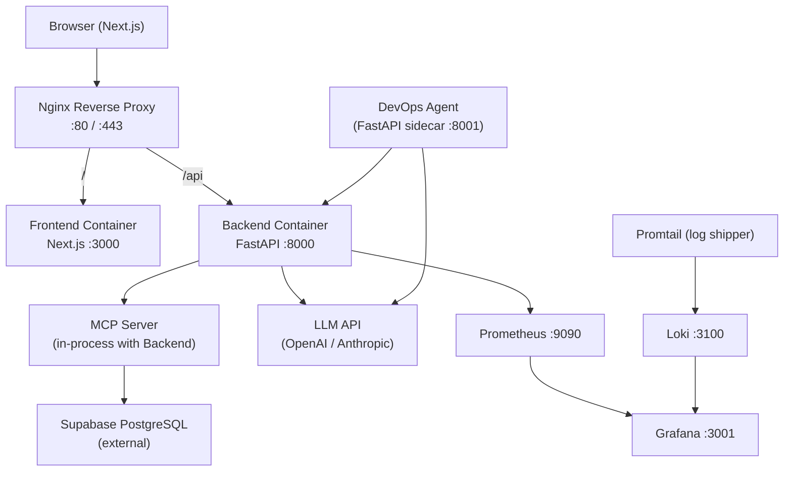

# Design Document — SupaChat

## Overview

SupaChat is a full-stack conversational analytics platform. Users type natural language questions about a blog analytics dataset; the backend translates those questions into SQL via an LLM, executes them against Supabase PostgreSQL through an MCP server, and returns structured results. The frontend renders responses as chat bubbles, sortable tables, and Recharts visualizations. The entire system is containerized, deployed on AWS EC2 behind Nginx, with GitHub Actions CI/CD and a Prometheus/Grafana/Loki observability stack.

---

## Architecture



All services run as Docker containers orchestrated by `docker-compose`. On EC2, GitHub Actions deploys by SSH-ing in and running `docker-compose pull && docker-compose up -d`.

---

## Components and Interfaces

### 2.1 Frontend (Next.js)

**Pages / Routes**
- `/` — main chat interface
- `/history` — query history (or sidebar panel on main page)

**Key Components**
- `ChatWindow` — scrollable message list, renders `ChatBubble` items
- `ChatInput` — text input + submit button, emits query to API
- `ChatBubble` — displays text summary; conditionally renders `DataTable` and `ChartPanel`
- `DataTable` — sortable table built with a headless table lib (TanStack Table)
- `ChartPanel` — selects and renders the correct Recharts chart type based on `chartType` field
- `HistorySidebar` — lists past queries; clicking one re-renders results
- `LoadingSpinner` / `ErrorBanner` — shared UI states

**API Client**
- `lib/api.ts` — thin wrapper around `fetch` targeting `/api/query` and `/api/history`

**State Management**
- React `useState` / `useReducer` for local chat state; no global store needed at this scale
- Query history persisted in `localStorage` and synced with `GET /api/history`

**Environment Variables**
```
NEXT_PUBLIC_API_URL=http://localhost/api
```

---

### 2.2 Backend (FastAPI)

**Endpoints**

| Method | Path | Description |
|--------|------|-------------|
| POST | `/api/query` | Accept NL query, return structured result |
| GET | `/api/history` | Return last 50 queries |
| GET | `/health` | Liveness check |
| GET | `/metrics` | Prometheus metrics (via `prometheus-fastapi-instrumentator`) |

**Request / Response Schemas**

```python
# POST /api/query
class QueryRequest(BaseModel):
    query: str          # natural language question
    session_id: str     # optional, for grouping history

class QueryResponse(BaseModel):
    summary: str        # LLM-generated text answer
    sql: str            # generated SQL (for transparency)
    columns: list[str]
    rows: list[list]    # raw tabular data
    chart_type: str     # "line" | "bar" | "pie" | "none"
    chart_data: list[dict]  # Recharts-ready series
    query_id: str
    timestamp: str
```

**Processing Pipeline**

```
POST /api/query
  │
  ├─ 1. Validate request
  ├─ 2. Build LLM prompt (schema context + user query)
  ├─ 3. Call LLM → get SQL
  ├─ 4. Call MCP tool execute_query(sql)
  ├─ 5. Format results (columns, rows, chart_data)
  ├─ 6. Generate text summary via LLM
  ├─ 7. Persist to history store
  └─ 8. Return QueryResponse
```

**Environment Variables**
```
SUPABASE_URL=
SUPABASE_SERVICE_KEY=
OPENAI_API_KEY=          # or ANTHROPIC_API_KEY
DATABASE_URL=            # postgres connection string
HISTORY_LIMIT=50
```

---

### 2.3 MCP Server

The MCP server runs in-process with the FastAPI backend as a Python module (using the `mcp` SDK). It registers the following tools:

| Tool | Description |
|------|-------------|
| `execute_query(sql: str)` | Run a read-only SQL query, return rows as JSON |
| `get_schema()` | Return table/column metadata for the LLM prompt |
| `get_topics()` | Return distinct topic list |

The MCP server connects to Supabase via the `asyncpg` driver using `DATABASE_URL`. All queries are wrapped in a read-only transaction to prevent mutations.

---

### 2.4 Supabase Schema

```sql
-- Articles
CREATE TABLE articles (
    id          SERIAL PRIMARY KEY,
    title       TEXT NOT NULL,
    topic       TEXT NOT NULL,
    author      TEXT,
    published_at TIMESTAMPTZ NOT NULL
);

-- Daily view counts
CREATE TABLE article_views (
    id          SERIAL PRIMARY KEY,
    article_id  INT REFERENCES articles(id),
    viewed_date DATE NOT NULL,
    view_count  INT NOT NULL DEFAULT 0
);

-- Engagement (likes, comments, shares)
CREATE TABLE article_engagement (
    id           SERIAL PRIMARY KEY,
    article_id   INT REFERENCES articles(id),
    event_date   DATE NOT NULL,
    likes        INT DEFAULT 0,
    comments     INT DEFAULT 0,
    shares       INT DEFAULT 0
);
```

Seed data: ~50 articles across 8 topics, 90 days of daily view/engagement records (~4,500 rows).

---

### 2.5 LLM Prompt Design

The system prompt sent to the LLM includes:
1. The full schema (table names, columns, types) from `get_schema()`
2. Today's date (for relative date resolution)
3. Instructions to return only valid PostgreSQL SQL with no explanation
4. A few-shot example for common query patterns

The user message is the raw natural language query. The LLM response is parsed to extract the SQL block.

---

### 2.6 Chart Type Detection

After query execution, the backend inspects the result shape to pick a chart type:

| Condition | Chart Type |
|-----------|-----------|
| 2 columns: date + numeric | `line` |
| 2 columns: category + numeric | `bar` |
| 2 columns: label + percentage/share | `pie` |
| >2 columns or no clear pattern | `none` (table only) |

`chart_data` is formatted as Recharts expects:
```json
// line / bar
[{"name": "2024-01-01", "views": 1200}, ...]

// pie
[{"name": "AI", "value": 340}, ...]
```

---

### 2.7 DevOps Agent (Bonus)

A lightweight FastAPI sidecar on port 8001 with these endpoints:

| Method | Path | Description |
|--------|------|-------------|
| POST | `/agent/deploy` | Trigger docker-compose pull + up -d via subprocess |
| POST | `/agent/restart` | Restart a named container |
| GET | `/agent/logs` | Fetch last N log lines + LLM summary |
| POST | `/agent/diagnose` | Accept CI failure log text, return RCA |
| GET | `/agent/health` | Consolidated health check across all services |
| POST | `/agent/alert` | Grafana webhook receiver → diagnostic summary |

The agent uses `subprocess` to run Docker CLI commands and calls the LLM API for summarization/RCA.

---

## Data Models

### History Store

Query history is stored in a lightweight SQLite database (via `aiosqlite`) local to the backend container. This avoids adding another external dependency for a non-critical feature.

```python
class HistoryRecord(BaseModel):
    query_id: str
    session_id: str
    nl_query: str
    sql: str
    summary: str
    columns: list[str]
    rows: list[list]
    chart_type: str
    chart_data: list[dict]
    timestamp: datetime
    error: str | None
```

---

## Error Handling

| Scenario | Behavior |
|----------|----------|
| LLM returns invalid SQL | Retry once with error feedback in prompt; if still invalid, return 422 with message |
| Supabase unreachable | Return 503 `{"error": "Database unavailable"}` |
| LLM API rate limit / timeout | Return 504 `{"error": "AI service timeout"}` |
| SQL returns 0 rows | Return success with empty `rows`, `chart_type: "none"`, summary says "No data found" |
| Malformed request body | FastAPI auto-returns 422 with field-level errors |
| Container OOM / crash | Docker health checks trigger restart; Prometheus alert fires |

All errors are logged at ERROR level and captured by Promtail → Loki.

---

## Infrastructure Design

### Docker Compose Services

```yaml
services:
  frontend:    # Next.js, port 3000, depends_on: backend
  backend:     # FastAPI, port 8000, depends_on: none (Supabase is external)
  devops-agent: # FastAPI sidecar, port 8001 (bonus)
  nginx:       # port 80, proxies / and /api
  prometheus:  # port 9090, scrapes backend /metrics
  grafana:     # port 3001, datasources: Prometheus + Loki
  loki:        # port 3100, log aggregation
  promtail:    # reads Docker container logs, ships to Loki
```

Resource limits (example):
```yaml
deploy:
  resources:
    limits:
      cpus: "0.5"
      memory: 512M
```

### Nginx Config

```nginx
server {
    listen 80;
    gzip on;
    gzip_types text/plain application/json text/css application/javascript;

    location / {
        proxy_pass http://frontend:3000;
        proxy_set_header Host $host;
    }

    location /api {
        proxy_pass http://backend:8000;
        proxy_set_header Host $host;
        proxy_set_header X-Real-IP $remote_addr;
    }

    location /metrics {
        deny all;  # internal only
    }

    # WebSocket support
    proxy_http_version 1.1;
    proxy_set_header Upgrade $http_upgrade;
    proxy_set_header Connection "upgrade";
}
```

### GitHub Actions Pipeline

```
on: push to main
jobs:
  build-and-push:
    - docker build frontend → ghcr.io/user/supachat-frontend:sha
    - docker build backend  → ghcr.io/user/supachat-backend:sha
    - docker push both images

  deploy:
    needs: build-and-push
    - SSH to EC2
    - docker-compose pull
    - docker-compose up -d --no-deps --scale frontend=1 backend=1
    - docker-compose ps (verify healthy)
```

Secrets stored in GitHub: `EC2_SSH_KEY`, `EC2_HOST`, `GHCR_TOKEN`, `SUPABASE_URL`, `SUPABASE_SERVICE_KEY`, `OPENAI_API_KEY`.

### Monitoring Stack

- **Prometheus** scrapes `backend:8000/metrics` every 15s. Metrics include request count, latency histograms, and Python process stats.
- **Grafana** provisioned with two dashboards via JSON files mounted at startup:
  - "SupaChat App" — request rate, p95 latency, error rate, active queries
  - "Infrastructure" — CPU, memory, container uptime
- **Loki + Promtail** — Promtail uses the Docker log driver to tail all container stdout/stderr and ships to Loki with labels `{container="..."}`. Grafana Explore panel queries Loki with LogQL.

---

## Testing Strategy

### Unit Tests
- Backend: `pytest` tests for SQL generation logic, chart type detection, response formatting
- Frontend: `jest` + `@testing-library/react` for `ChatBubble`, `DataTable`, `ChartPanel` components

### Integration Tests
- Backend: `pytest` with `httpx.AsyncClient` against a test Supabase instance (or local Postgres via Docker)
- Test the full pipeline: NL query → SQL → mock DB response → formatted output

### End-to-End Tests
- `Playwright` smoke tests: load page, submit a sample query, assert a chart renders

### CI Test Step
- GitHub Actions runs `pytest` and `jest --ci` before building Docker images; failures block the deploy job.

---

## Project Structure

```
supachat/
├── frontend/
│   ├── Dockerfile
│   ├── package.json
│   ├── next.config.js
│   └── src/
│       ├── app/
│       │   └── page.tsx          # main chat page
│       ├── components/
│       │   ├── ChatWindow.tsx
│       │   ├── ChatInput.tsx
│       │   ├── ChatBubble.tsx
│       │   ├── DataTable.tsx
│       │   ├── ChartPanel.tsx
│       │   └── HistorySidebar.tsx
│       └── lib/
│           └── api.ts
├── backend/
│   ├── Dockerfile
│   ├── requirements.txt
│   └── app/
│       ├── main.py               # FastAPI app
│       ├── mcp_server.py         # MCP tool definitions
│       ├── llm.py                # LLM prompt + SQL extraction
│       ├── db.py                 # asyncpg connection
│       ├── formatter.py          # chart type detection + data shaping
│       ├── history.py            # SQLite history store
│       └── schemas.py            # Pydantic models
├── devops-agent/                 # bonus
│   ├── Dockerfile
│   └── app/
│       └── main.py
├── nginx/
│   └── nginx.conf
├── monitoring/
│   ├── prometheus.yml
│   ├── loki-config.yml
│   ├── promtail-config.yml
│   └── grafana/
│       ├── datasources.yml
│       └── dashboards/
│           ├── supachat.json
│           └── infrastructure.json
├── .github/
│   └── workflows/
│       └── deploy.yml
├── docker-compose.yml
├── .env.example
└── README.md
```
